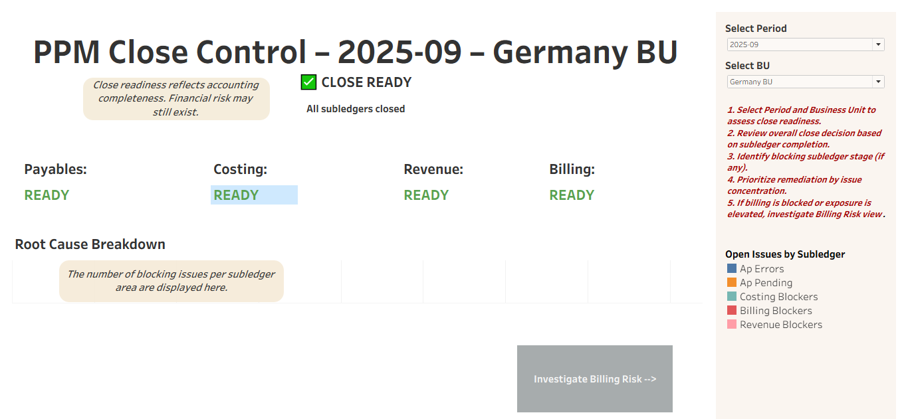
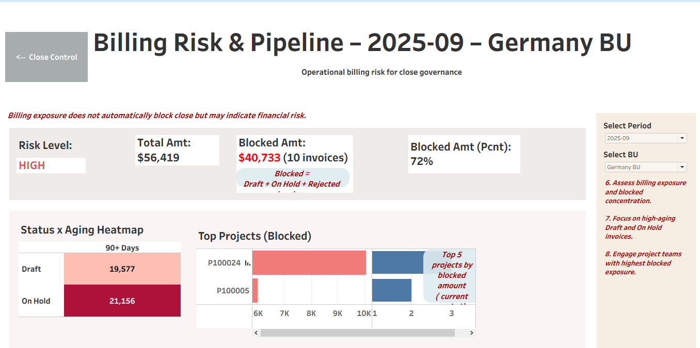
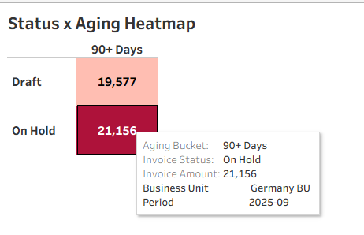

# PPM–Financial Close Governance Integration Framework
**Oracle Cloud PPM | Tableau | Financial Risk Analytics**
## Executive Summary

This project integrates operational PPM period close readiness with billing exposure analytics to provide a unified governance framework. It bridges subledger dependency control with financial risk visibility using Tableau.

## Business Problem
In Oracle Cloud environments, PPM period close is often treated as a technical checklist:
Close Payables
Run Costing
Validate Revenue
Review Billing
Close Project Period

However, organizations struggle with two recurring issues:
Close readiness is assessed operationally, not financially.
Billing exposure and aging risks are not surfaced before GL close.

As a result:
Period close may be technically complete.
But significant billing risk remains hidden.
Controllers lack visibility into subledger-to-GL dependencies.

## Solution Overview
I designed a two-layer governance framework in Tableau that integrates:
PPM operational close readiness
Financial exposure and billing risk analysis
The solution bridges project subledger execution with financial close oversight.

## Dashboard 1 — PPM Close Governance

*Figure 1: Period-specific PPM close governance view with subledger dependency modeling.*

### Purpose:
Determine whether the period is ready to close.
Key Components
Dynamic context header (Period + BU)
Overall Close Decision (READY / NOT READY)
Subledger Dependency Flow:
AP → Costing → Revenue → Billing → Project Close
Root Cause Breakdown (Open Issues by Subledger)
Governance Value
Makes close gating logic explicit.
Surfaces upstream dependencies.
Provides a clean executive control view.

## Dependency Modeling Section

## Dashboard 2 — Billing Risk & Exposure

*Figure 3: Technical close readiness contrasted with elevated billing exposure risk*

Purpose:
Diagnose financial exposure embedded in the close.
Key Components
KPI Strip:
Total Invoice Amount
Blocked Amount
% Blocked
Blocked Invoice Count
Status × Aging Risk Matrix
Top Projects by Blocked Amount
Exposure Concentration Analysis

## Risk Scenario Example (Germany 2025-09)

*Figure 4: PPM is ready to close despite high financial risk (72% if invoice amounts blocked)*

## Key Design Decisions

### Parameter-driven architecture

*Figure 5: Parameter-driven cross-dashboard synchronization*

## Insights
A worrisome high percentage of invoice value blocked.

*Figure 6: Billing exposure summary highlighting blocked revenue concentration (KPIs)*

### Heavy 90+ day aging

*Figure 7: Blocked invoice concentration by status and aging bucket*

## Top 5 projects in trouble (based on blocked invoice amount)

*Figure 8: Project-level exposure prioritization for operational intervention*

