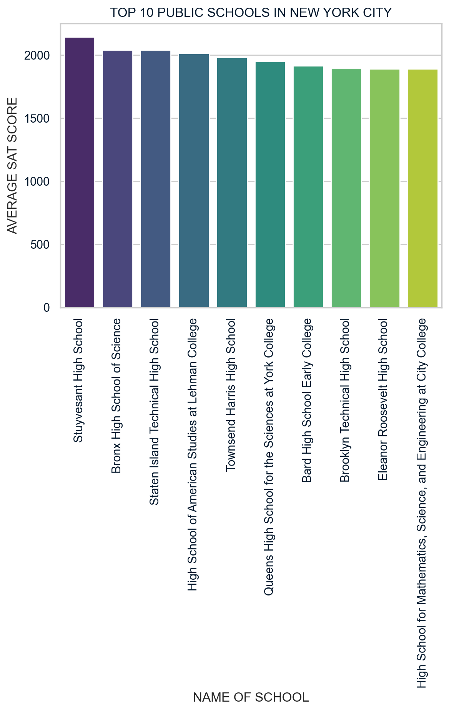

# My Data Science Portfolio

## Projects

## Investigating Netflix Movies
 
### Objective
The objective of this project was to conduct exploratory data analysis on Netflix data to uncover insights into movies from the 1990s, a pivotal decade in the modern film industry, and provide answers to specific business questions.
i
### Tools
I  used Pandas for manipulating the dataset, Matplotlib for visualization, and Python for programming.
### Procedure
Having loaded pre-cleaned Netflix data into a pandas DataFrame, I subsetted the DataFrame to include only movies released between 1990 and 1999.

I then created a histogram based on the 'Duration' column. This visualization enabled me to determine the distribution of movie lengths in that decade, especially the most common movie duration and other insights.

I applied a second filter to isolate the 'Action' genre. Then I iterated through this filtered dataset using a for loop with a counter variable to count each movie that met various duration criteria.
### Impact
The results had a direct impact on Netflix's content strategy, enhancing user experience and refining its market position.

## New York City Public School Results

The project's objective was to evaluate the performance of New York City public schools and provide policymakers, government officials, parents, and other stakeholders with actionable insights and answers to pertinent questions, especially
- Which schools have the best math results?
- What are the top ten schools based on combined SAT scores?
- What is the distribution of SAT scores by borough?

After importing data from a CSV file, I used Pandas DataFrames to perform a thorough data validation and ensure the dataset was clean and ready for analysis. 

Throughout the project, I employed data visualization tools from the Matplotlib and Seaborn packages to present the findings clearly and highlight significant trends.

To determine the schools with the best math results, I subsetted the DataFrame according to a given metric (math score greater than 80).

To identify the top ten schools, I created a new column in the original DataFrame that represents the total score. This total score is calculated by summing the three existing SAT columns: Math, Reading, and Writing. Next, I sorted the DataFrame by this new column in descending order and selected the top ten rows.

To summarize SAT performance across the various boroughs of New York City, I organized the data by borough and then calculated the count, mean, and standard deviation for each borough.

The project provided answers to the following questions about New York City schools:
- Schools with the best Math results
- The top ten schools based on a combined average of three SAT scores
- The count, mean, and standard deviation of SAT scores by borough

The results of this analysis provided actionable insights that can inform educational policymakers, guide parents in making school choices, and support resource allocation by city planners.

## Visualizing the History of Nobel Prize Winners

## Analyzing Crime in LA

## Customer Analytics: Preparing Data for Modelling

## Exploring Airbnb Market Trends

## Modeling Car Insurance Claim Outcomes

## Hypothesis Testing With Men's and Women's Soccer Matches

### Predictive Modeling for Agriculture

##  Clustering Antarctic Penguin Species

## Predicting Movie Rental Durations 

