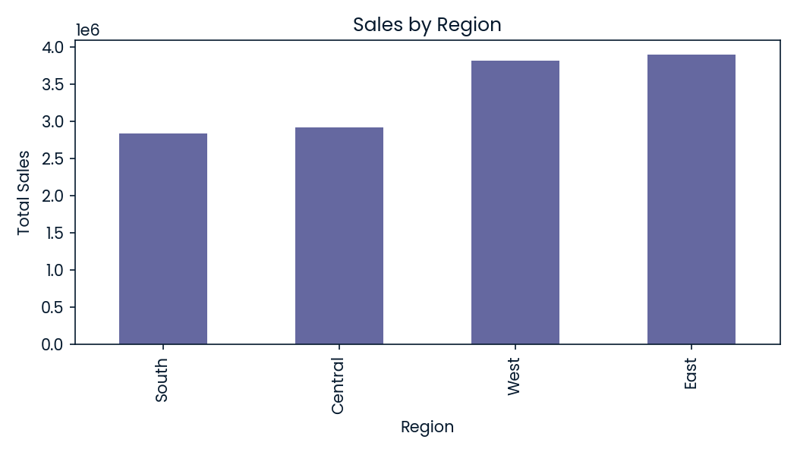
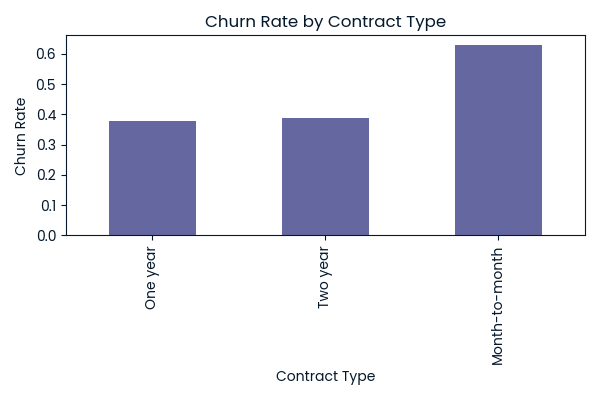

# Theo Acquah — Data Analytics

Data Analyst specializing in **enterprise analytics, financial performance, portfolio intelligence, and business-focused data storytelling**.

This portfolio showcases projects built with **Python, SQL, Tableau, and Oracle Cloud PPM/ERP data**. The work focuses on solving real business problems through KPI design, dashboarding, exploratory analysis, and actionable recommendations.

---

## About Me

I bring a blend of **enterprise systems knowledge** and **analytics capability**, with experience translating complex business data into decision-ready insights.

My portfolio focuses on:
- Financial and profitability analytics
- Portfolio performance and delivery risk
- Resource capacity and utilization
- ERP and operational control analytics
- Customer and business performance analysis

---

## Tools & Technologies

- **Python**: pandas, numpy, matplotlib, scikit-learn
- **SQL**
- **Tableau**
- **Oracle Cloud PPM / ERP Analytics**
- **Data Modeling**
- **KPI Development**
- **Dashboard Design**
- **Data Visualization**
- **Business Intelligence**
- **Executive Reporting**

---

## What This Portfolio Demonstrates

- End-to-end data analysis using Python and SQL
- Business-focused KPI design and reporting
- Financial, operational, and portfolio analytics
- Executive dashboard development
- Ability to turn raw data into clear business recommendations
- Strong alignment between analytics outputs and decision-making needs

---

## Featured Projects

### 1) Sales Performance & Profitability Analysis (Python)

Business-focused Python analysis exploring revenue drivers, profitability, discount impact, and product performance across regions and customer segments.

**Key Skills:** Python, pandas, KPI analysis, profitability analysis, data visualization, business recommendations  
[View Project](sales_performance/)

---

### 2) Customer Churn Risk Analysis (Python)

Python project analyzing customer churn behavior to identify risk drivers, customer segments with elevated churn probability, and actions to improve retention.

**Key Skills:** Python, exploratory data analysis, feature analysis, churn analytics, business insights  
[View Project](customer_churn/)

---

### 3) Executive Project Portfolio Performance & Risk Analytics (Tableau)

Executive dashboard analyzing project portfolio financial condition, delivery risk, resource capacity pressure, and prioritization opportunities across enterprise initiatives.

**Key Skills:** Tableau, portfolio analytics, KPI design, scenario analysis, executive reporting  
[View Project](ppmanalytics/)

---

### 4) ERP Period Close Bottleneck Analysis (Tableau)

Operational analytics project identifying blocked revenue, invoice aging, close-cycle bottlenecks, and exception patterns affecting financial readiness.

**Key Skills:** Tableau, ERP analytics, financial operations, bottleneck analysis, business storytelling  
[View Project](PPMclose/)

---

### 5) Intercompany Billing Control Tower (Tableau)

Control-tower style analytics solution providing visibility from project cost capture through billing, SLA, and GL posting to support operational control and financial governance.

**Key Skills:** Tableau, ERP lifecycle analytics, intercompany billing, audit visibility, KPI design  
[View Project](interco)

---

### 6) Revenue Leakage & Billing Efficiency Analysis (SQL)

Using SQL to analyze ERP data to provide actionable financial and operational insights.

**Key Skills:** SQL, Advanced queries (Table functions, Window functions, etc.), KPI engineering.  
[View Project](revenue-sql-analysis)
