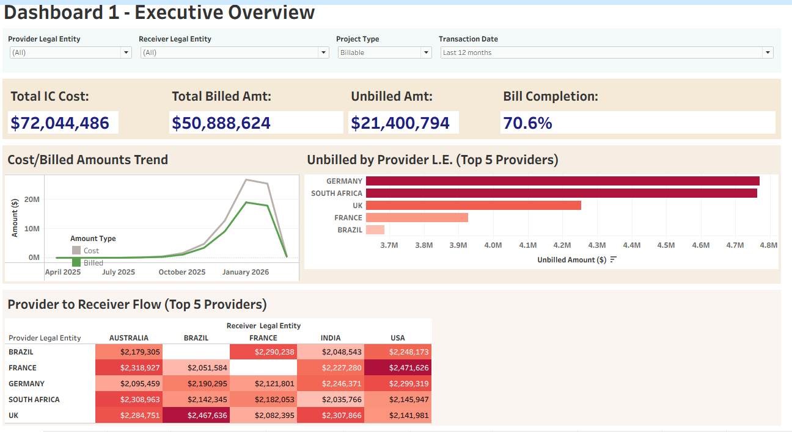
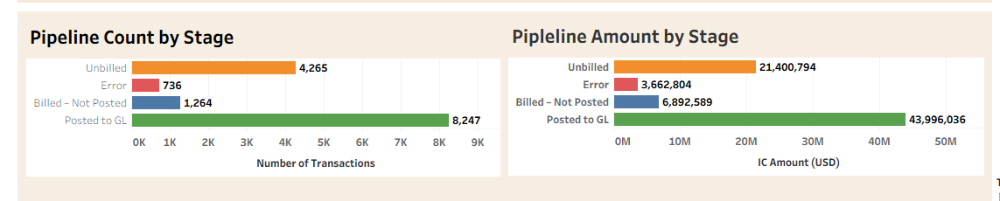
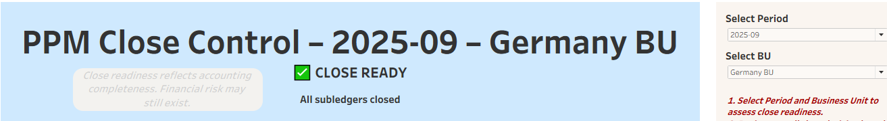
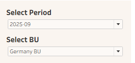
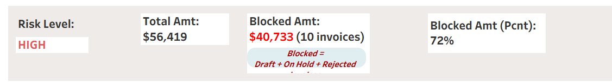
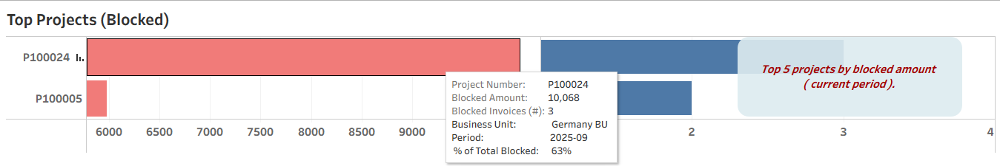

# My Data Science Portfolio

I am an experienced Information Technologist with a passion for data science. I love data science because it is a key driver of the AI revolution, transforming our world, identifying needs, opportunities, and areas for improvement. I am a Data Analyst, working my way up to becoming a Data Scientist.

## Education
- BSc (Honours) Information Systems in Computer Science and Information Systems, University of South Africa
- Certificate in Oracle E-Commerce Development, University of Toronto
- Certificate in Project Leadership (Postgraduate) in Project Management, University of Waterloo 

## Data Science credentials:
- Data Analyst (Python), DataCamp
- Data Analyst Associate (SQL), DataCamp
- Associate Data Scientist, DataCamp (to be completed soon)

## Data Science Courses completed:
### Python
- Introduction to Python
- Intermediate Python
- Data Manipulation with Pandas
- Joining Data With Pandas
- Introduction to Statistics in Python
- Introduction to Data Visualization With Matplotlib
- Introduction to Data Visualization With Seaborn
- Introduction to Functions in Python
- Python Toolbox 
- Exploratory Data Analysis in Python
- Working With Categorical Data in Python
- Data Communication Concepts
- Introduction to Importing Data in Python
- Cleaning Data in Python
- Working With Dates and Times in Python
- Writing Functions in Python
- Introduction to Regression With Statsmodels in Python
- Sampling in Python
- Hypothesis Testing in Python
- Experimental Design in Python
- Supervised Learning with Scikit-Learn
- Unsupervised Learning in Python
- Machine Learning With Tree-based Models in Python

### SQL
- Joining Data in SQL
- Data Manipulation in SQL
- Exploratory Data Analysis in SQL
- PostgreSQL Summary Stats and Window Function
- Data-Driven Decision Making in SQL
- Applying SQL to Real-World Problems

## My Latest Projects
======
# Intercompany Billing Control Tower
### Oracle Cloud PPM + Tableau Analytics
A finance analytics solution that provides end-to-end visibility into the intercompany billing lifecycle, from project cost capture through billing and GL posting.
This project demonstrates how Tableau dashboards can transform intercompany billing from a reactive accounting task into a proactive operational control process.

## Project Overview
Global project organizations frequently struggle to monitor intercompany billing across legal entities.
Key challenges include:
- delayed intercompany billing
- billing errors
- transactions not posted to the General Ledger
- fragmented reporting across finance systems

To address these issues, this project builds a Tableau-based control tower that allows finance and project management teams to monitor the entire lifecycle of intercompany billing in real time.

The dashboards provide:
- executive performance monitoring
- operational pipeline visibility
- transaction-level audit traceability

## Dashboard Preview

Fig 1 - *The three dashboards that work together to provide a framework for intercompany billing control.*

## Key design considerations:
- Role-playing dimension for legal entities
- Transaction grain at expenditure item level
- Lifecycle tracking fields including billing_status, accounting_status, gl_posted_flag

All financial metrics are presented in the enterprise reporting currency (USD).

## Dashboard Walkthrough
### Executive Overview
The Executive Overview dashboard provides leadership with a high-level health check of intercompany billing performance.
Key metrics include:
- Total Intercompany Cost
- Total Billed Amount
- Billing Completion %
- Intercompany Exposure

This view allows executives to quickly identify whether billing keeps pace with project costs and which legal entities generate the largest exposure.

Fig 2 - *Executive overview of intercompany billing performance, showing recovery trends, unbilled exposure by provider legal entity, and cross-entity billing flows.*

### Billing Pipeline & Aging
The Billing Pipeline dashboard highlights where transactions are currently sitting in the intercompany lifecycle.
Pipeline stages include:
- Unbilled
- Error
- Billed – Not Posted
- Posted to GL

In addition, aging analysis groups transactions into operational risk buckets:
- 0–7 days
- 8–30 days
- 31–60 days
- 60+ days

This allows finance teams to identify transactions approaching month-end reconciliation risk.

Fig 3 - *Billing pileline highlighting the distribution of transactions in the intercompany billing lifecycle and the corresponding amounts involved*

### Exception Monitoring
Instead of displaying all transactions, the dashboard surfaces exceptions requiring operational attention, including:
- billing errors
- aged unbilled transactions
- billed transactions not yet posted to the General Ledger

This exception-based design allows finance teams to focus on the transactions most likely to cause operational delays.

Fig 4 - *Transaction errors that need urgent attention*

### Transaction Audit Dashboard
The Audit dashboard provides transaction-level traceability from high-level KPIs down to individual records.
This view supports:
investigation of billing issues
reconciliation during month-end close
audit transparency
Each transaction includes contextual information such as:
- project name
- provider and receiver legal entities
- billing status
- billing age
- exposure amount

To simplify investigation, an Exception Reason field explains why a transaction remains in the pipeline.
Example reasons include:
- Billing error – requires correction
- Unbilled > 30 days – billing delay
- Billed but not posted to GL

Fig 6 - *Audit-ready transaction drill-down, providing full traceability from project cost through billing, accounting, and GL posting.*

## Key Insights Discovered
Analysis of the dashboards revealed several patterns typical of global project organizations.
### Intercompany activity is concentrated in delivery centers
Intercompany flows show that many services originate from a small number of delivery entities supporting projects across multiple regions.

### Most exposure occurs before billing
The majority of financial exposure sits in the Unbilled stage, suggesting that operational billing delays are the primary driver of risk rather than accounting processes.

### Aging highlights emerging month-end risk
While most transactions are resolved within 30 days, a smaller subset of aged transactions represents potential reconciliation challenges during the close cycle.

### Billing errors are rare but operationally expensive
Although billing errors represent a small share of transactions, they tend to remain unresolved longer and require manual intervention.

## Business Value Delivered
The Intercompany Billing Control Tower improves financial oversight by enabling organizations to monitor intercompany billing continuously rather than relying on periodic reporting.
### Improved financial visibility
Leadership gains real-time insight into billing performance and exposure across legal entities.

### Earlier detection of billing delays
Operational teams can identify unbilled or delayed transactions before month-end reconciliation begins.

### Faster investigation of exceptions
Finance teams can quickly trace issues to the underlying project and legal entity without manual reconciliation.

### Reduced operational complexity
By consolidating multiple reporting views into a structured dashboard suite, the solution simplifies monitoring of the entire intercompany billing lifecycle.

## Implementation Challenges & Solutions
### Realistic financial data modeling
Early versions of the dataset produced unrealistic results such as excessive aging and billing completion above 100%.
The dataset was redesigned to simulate realistic lifecycle patterns and transaction distributions.
### Role-playing dimensions
The Legal Entity dimension appears twice in the model to represent Provider and Receiver roles.

### Dashboard usability
Large transaction tables were redesigned as exception-based views, ensuring that finance teams see only transactions requiring action.

## Future Enhancements
Potential extensions to this solution include:
- integration with real-time Oracle Cloud PPM data
- currency conversion using transaction and reporting currencies
- automated alerts for aged transactions
- predictive models identifying transactions likely to miss billing SLAs

## Key Takeaway
This project demonstrates how analytics can transform intercompany billing from a reactive accounting process into a proactive operational control system.
By combining executive monitoring, operational pipeline analysis, and transaction-level traceability, the dashboards provide finance teams with continuous visibility into the intercompany billing lifecycle.

========
# PPM–Financial Close Governance Integration Framework
**Oracle Cloud PPM | Tableau | Financial Risk Analytics**
## Executive Summary

This project integrates operational PPM period close readiness with billing exposure analytics to provide a unified governance framework. It bridges subledger dependency control with financial risk visibility using Tableau.

## Business Problem
In Oracle Cloud environments, PPM period close is often treated as a technical checklist:
Close Payables
Run Costing
Validate Revenue
Review Billing
Close Project Period

However, organizations struggle with two recurring issues:
Close readiness is assessed operationally, not financially.
Billing exposure and aging risks are not surfaced before GL close.

As a result:
Period close may be technically complete.
But significant billing risk remains hidden.
Controllers lack visibility into subledger-to-GL dependencies.

## Solution Overview
I designed a two-layer governance framework in Tableau that integrates:
PPM operational close readiness
Financial exposure and billing risk analysis
The solution bridges project subledger execution with financial close oversight.

## Dashboard 1 — PPM Close Governance

*Figure 1: Period-specific PPM close governance view with subledger dependency modeling.*

### Purpose:
Determine whether the period is ready to close.
Key Components
Dynamic context header (Period + BU)
Overall Close Decision (READY / NOT READY)
Subledger Dependency Flow:
AP → Costing → Revenue → Billing → Project Close
Root Cause Breakdown (Open Issues by Subledger)
Governance Value
Makes close gating logic explicit.
Surfaces upstream dependencies.
Provides a clean executive control view.

## Dependency Modeling Section

## Dashboard 2 — Billing Risk & Exposure

*Figure 3: Technical close readiness contrasted with elevated billing exposure risk*

Purpose:
Diagnose financial exposure embedded in the close.
Key Components
KPI Strip:
Total Invoice Amount
Blocked Amount
% Blocked
Blocked Invoice Count
Status × Aging Risk Matrix
Top Projects by Blocked Amount
Exposure Concentration Analysis

## Risk Scenario Example (Germany 2025-09)

*Figure 4: PPM is ready to close despite high financial risk (72% if invoice amounts blocked)*

## Key Design Decisions

### Parameter-driven architecture

*Figure 5: Parameter-driven cross-dashboard synchronization*

## Insights
A worrisome high percentage of invoice value blocked.

*Figure 6: Billing exposure summary highlighting blocked revenue concentration (KPIs)*

### Heavy 90+ day aging

*Figure 7: Blocked invoice concentration by status and aging bucket*

## Top 5 projects in trouble (based on blocked invoice amount)

*Figure 8: Project-level exposure prioritization for operational intervention*

============
## Executive Project Portfolio Performance & Risk (PPM Analytics)
This project demonstrates executive portfolio analytics for an integrated Project Portfolio Management (PPM) environment. The dashboard combines financial performance, delivery risk, and resource capacity to support prioritization and leadership decision-making.

### Executive Project Portfolio Performance & Risk Overview
An integrated dashboard combining financial performance, delivery health, and resource capacity to support executive portfolio decisions.

### Portfolio Financial Baseline
Executive KPIs establish approved budget, actual spend, remaining headroom, and budget consumption across the portfolio.

### Portfolio Spend Is Concentrated Across a Small Number of Portfolios
A limited set of portfolios account for the majority of approved spend, increasing exposure if delivery performance declines.

### Delivery Risk Is Unevenly Distributed Across the Portfolio
Certain portfolios exhibit a disproportionate number of projects behind schedule, independent of total budget size.

### Systemic Resource Pressure Drives Delivery Risk
Multiple roles exceed utilization thresholds during peak execution periods, indicating structural capacity constraints rather than isolated issues.

### High-Value Projects Behind Schedule Require Immediate Attention
Mapping project value against schedule variance highlights where executive intervention can deliver the greatest impact.

## Business Background

CDK Global encountered ongoing challenges in managing financial controls, delivery performance, and resource capacity across multiple projects using the Oracle Cloud Project Portfolio Management (PPM) platform.

Senior leadership needed to address a recurring question.

Where is the portfolio exposed, what causes this exposure, and where should intervention be prioritized?

Without an integrated executive dashboard, CDK Global risks multi-million-dollar losses from unchecked budget overruns and potential schedule delays on key projects. Executives require a dashboard that consolidates budget performance, schedule risk, and resource pressure into a single executive view.

## Business Objectives

The objective was to design a portfolio dashboard that enables leadership to:

1. Understand the overall portfolio financial condition.
2. Identify delivery risk beyond acceptable tolerance.
3. Detect systemic resource capacity pressure.
4. Prioritize high-value projects requiring intervention.
5. Explore risk tolerance scenarios.

## Data Overview

### Core entities

* Projects (portfolio, type, region, planned budget, progress)
* Project budgets (labor and non-labor categories)
* Time-phased actual costs
* Time-phased revenue / value realization
* Resources and roles
* Monthly resource assignments (hours and labor cost)
* Calendar month dimension

Each table was modeled at the appropriate level of detail and linked by logical relationships to prevent duplication and ensure data accuracy.

## Metrics Defined

Total Planned Budget: Sum of approved project budgets across the portfolio.

Actual Cost to Date: Cumulative actual costs recorded for all projects.

Budget Variance: The difference between the approved budget and actual cost.

Budget Consumed: Ratio of actual cost to approved budget.

Schedule Variance: The difference between the actual and planned percent complete.

Delivery Risk Status: Parameter-driven classification of projects based on schedule variance tolerance.

Role Utilization: Ratio of assigned hours to available capacity per role per month.

Capacity Risk Status: Classification of roles as Overallocated, Balanced, or Underutilized based on utilization thresholds.

## Analytical Approach

I applied a layered, validation-first approach to the analysis. Parameters governed analytical logic instead of filtering data, allowing leadership to explore different risk tolerances without recalculating base metrics. My approach included the following steps:

Step 1 - Financial Baseline: Established CFO-approved totals before introducing trends and segmentation.

Step 2 - Delivery Health: Evaluated schedule performance independently from financial indicators.

Step 3 - Resource Utilization: Modeled capacity pressure using explicit, defensible assumptions.

Step 4 - Portfolio Segmentation: Integrated finance, delivery, and resources to expose priority areas.

Step 5 - Executive Assembly: Developed a single-page dashboard for the steering committee.

## Executive Dashboard Design

### KPIs Section

A KPI row provides immediate context, linking each metric directly to a decision. 

KPI 1: Total Portfolio Budget to understand the scope and scale of the financial commitment.

KPI 2: Actual Cost to Date, so we can assess spending efficiency against the planned numbers.

KPI 3: Budget Variance, to identify any immediate financial discrepancies that require attention.

KPI 4: Budget Consumed, so we can evaluate the rate of expenditure relative to budgeted resources and adjust as necessary.

These KPIs address portfolio size and budget utilization efficiency.

### Key Insights Section

Insight 1: Portfolio spend is concentrated in a few portfolios, increasing exposure if delivery issues occur.

Insight 2: Schedule risk is unevenly distributed and does not always correlate with budget size.

Insight 3: Several roles exceed utilization thresholds during peak periods, indicating ongoing capacity pressure.

Insight 4: Several high-budget projects are behind schedule, representing significant delivery risk.

## Recommendations

Based on the analysis, I recommend the following actions.

1. Prioritize high-value, high-risk projects by intervening in projects combining large budgets with negative schedule variance.
2. Manage systemic resource pressure by rebalancing capacity or sequencing work to reduce ongoing role overutilization.
3. Explicitly align risk tolerance by using parameter-driven thresholds to ensure delivery expectations match the organization's risk profile.
4. Maintain portfolio balance by ensuring interventions address both large portfolios and smaller, high-risk areas.

## Why This Project Matters

The dashboard goes beyond reporting isolated metrics and supports leadership decisions in the following ways. By equipping executives with insights that drive confident decision-making, we can envision a future in which leadership accurately steers the portfolio toward strategic objectives, ensuring optimal resource utilization and project success.

* Design trustworthy KPIs. 
* Integrate finance, delivery, and resource data seamlessly.
* Use parameters for scenario-based decision support.
* Communicate portfolio risk clearly and concisely.

## Follow Up

With additional data, I would expand this work by:

* Modeling forecasted Estimate-at-Completion (EAC)
* Analyzing delivery risk by project phase
* Simulating capacity adjustments and schedule impact
* Integrating benefits realization metrics

## Final Note

This project demonstrates my approach to enterprise analytics challenges.

Validate first, integrate carefully, and design dashboards that leaders can act on immediately.

## Design Tools

* Tableau 
*  Parameters 
* Calculated Fields

# Revenue Health & Churn Risk (Executive Decision Support)

   

## Tools

* Tableau
* Parameters & Actions
* Calculated Fields

## 1. Business Background

A telecommunications company uses a subscription model with multiple contract types and customer segments. While revenue appears steady, leadership faces an ongoing challenge:

** How much revenue is exposed to churn risk, and how sensitive is that risk to leadership’s tolerance level?

This project enables executives to simulate risk tolerance decisions and immediately see their impact on revenue exposure.

## 2. Business Objectives

This project supports executive decision-making by answering the following questions:

* How concentrated is revenue across contract types?
* Which segments exceed acceptable churn risk?
* How does revenue exposure change as churn tolerance tightens or loosens?
* Where should retention efforts be given priority to protect revenue?

## 3. Data Overview

The dataset contains customer-level subscription data, including:

* Monthly charges (revenue proxy)
* Customer tenure (lifecycle indicator)
* Contract type
* Internet service type
* Customer churn status (Yes/No)

The dataset lacks calendar-based snapshots. All metrics were defined bearing this in mind, to ensure accuracy, transparency, and defensibility.

## 4. Key Metrics Defined

Active Monthly Revenue

Sum of monthly charges for non-churned customers - used as a proxy for Monthly Recurring Revenue (MRR)

Active Customers

Distinct count of customers who have not churned.

Customer Churn Rate

Proportion of customers who have discontinued within each segment.

Note: Monthly churn was intentionally avoided due to data limitations.

Revenue at High Churn Risk (Executive KPI)

Revenue associated with segments whose churn rate exceeds a user-defined risk threshold.

## 5. Analytical Approach

This project goes beyond descriptive analytics by introducing parameter-driven what-if analysis.

Key design principles:

* Metrics remain stable and validated.
* Parameters control analytical logic, not data filtering.
* Executives define what “high risk” means.
* The dashboard responds instantly without recalculating base metrics.

## 6. Dashboard Design

## Key Business KPIs with Risk Exposure
In addition to core revenue and churn metrics, this dashboard quantifies how much revenue is exposed to churn risk above a configurable tolerance level.

A dedicated KPI row provides immediate business context:

* Active Monthly Revenue
* Active Customers
* Overall Customer Churn Rate
* Revenue at High Churn Risk (dynamic)

Together, these KPIs answer:

“How large is the business, and how much of it is at risk?”

Core Analytical Views

Revenue Contribution by Contract

Highlights revenue concentration across contract types, showing which segments are most critical to business stability.

Customer Churn Risk by Contract

Uses parameter-driven coloring to classify contract types as acceptable risk or high risk, based on executive-defined thresholds.

Monthly Charges vs Customer Tenure

Provides diagnostic insight into the relationship between customer tenure and revenue contribution.

## Key Insights

### 1. Medium tenure and long-tenure contracts generate the most revenue.

### 2. Revenue Is Concentrated in Long-Term Contracts, creating both strength and dependency.

A small number of contract types generate the majority of revenue, creating both stability and concentration risk.
  
### 3. As churn risk thresholds tighten, a disproportionate share of revenue becomes classified as “at risk.”

Executives can adjust churn risk tolerance and instantly identify which contract types exceed acceptable risk levels.

### 4. Tenure Is Associated with Higher Monthly Charges

Longer-tenured customers tend to generate higher monthly revenue, reinforcing the importance of retention-focused strategies.

## 7. Recommendations

Based on the analysis:

1. Protect high-value segments
2. Prioritize retention strategies for long-term contract customers who contribute the majority of revenue.
3. Reduce exposure in high-risk segments.
4. Introduce targeted incentives or contract migration strategies for month-to-month customers.
5. Use risk tolerance explicitly.
6. Leadership should align churn risk thresholds with the business strategy, while being aware of the trade-off between growth flexibility and revenue consistency.

## 8. Why This Project Matters

This project shows my ability to:

* Design executive-focused KPIs
* Use parameters for scenario simulation, not gimmicks.
* Translate analytical metrics into risk-based decision support.
* Balance technical correctness with business usability.

Instead of reporting churn and revenue independently, this dashboard connects them to inform leadership action.

## 9. What I would Explore Next

With additional data, I would extend this analysis by:

* Modeling churn risk by tenure cohorts
* Quantifying the cost of churn-mitigation strategies
* Simulating revenue impact of contract-mix changes
* Integrating time-based churn snapshots for trend analysis

## Final Note

This project demonstrates how I approach executive analytics problems:

* clear metric definitions
* validated logic
* interactive tools that support real decisions instead of static reporting

​

