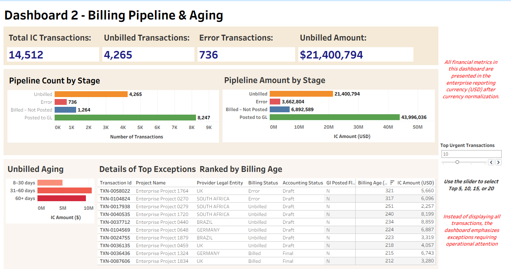
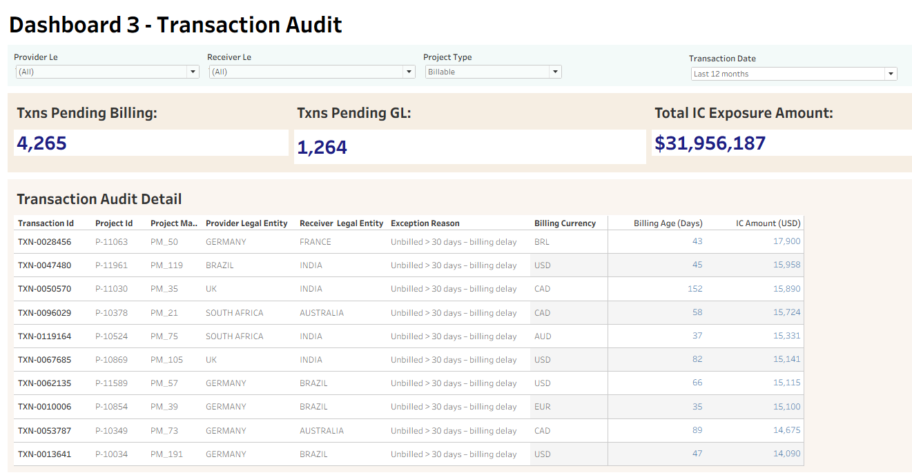
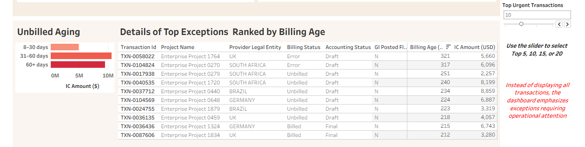
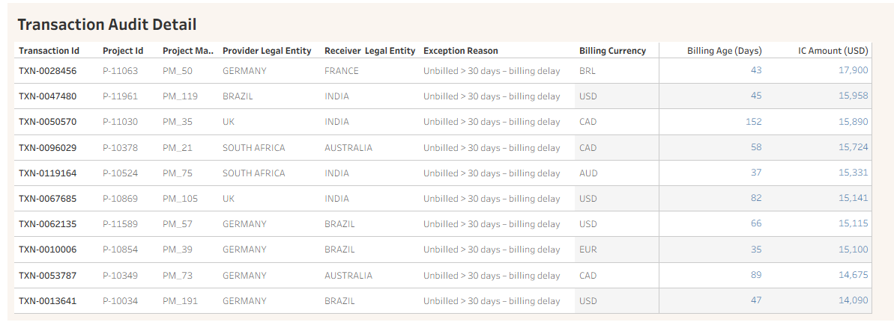

# Intercompany Billing Control Tower
### Oracle Cloud PPM + Tableau Analytics
A finance analytics solution that provides end-to-end visibility into the intercompany billing lifecycle, from project cost capture through billing and GL posting.
This project demonstrates how Tableau dashboards can transform intercompany billing from a reactive accounting task into a proactive operational control process.

## Project Overview
Global project organizations frequently struggle to monitor intercompany billing across legal entities.
Key challenges include:
- delayed intercompany billing
- billing errors
- transactions not posted to the General Ledger
- fragmented reporting across finance systems

To address these issues, this project builds a Tableau-based control tower that allows finance and project management teams to monitor the entire lifecycle of intercompany billing in real time.

The dashboards provide:
- executive performance monitoring
- operational pipeline visibility
- transaction-level audit traceability

## Dashboard Preview

Fig 1 - *The three dashboards that work together to provide a framework for intercompany billing control.*

## Key design considerations:
- Role-playing dimension for legal entities
- Transaction grain at expenditure item level
- Lifecycle tracking fields including billing_status, accounting_status, gl_posted_flag

All financial metrics are presented in the enterprise reporting currency (USD).

## Dashboard Walkthrough
### Executive Overview
The Executive Overview dashboard provides leadership with a high-level health check of intercompany billing performance.
Key metrics include:
- Total Intercompany Cost
- Total Billed Amount
- Billing Completion %
- Intercompany Exposure

This view allows executives to quickly identify whether billing keeps pace with project costs and which legal entities generate the largest exposure.

Fig 2 - *Executive overview of intercompany billing performance, showing recovery trends, unbilled exposure by provider legal entity, and cross-entity billing flows.*

### Billing Pipeline & Aging
The Billing Pipeline dashboard highlights where transactions are currently sitting in the intercompany lifecycle.
Pipeline stages include:
- Unbilled
- Error
- Billed – Not Posted
- Posted to GL

In addition, aging analysis groups transactions into operational risk buckets:
- 0–7 days
- 8–30 days
- 31–60 days
- 60+ days

This allows finance teams to identify transactions approaching month-end reconciliation risk.

Fig 3 - *Billing pileline highlighting the distribution of transactions in the intercompany billing lifecycle and the corresponding amounts involved*

### Exception Monitoring
Instead of displaying all transactions, the dashboard surfaces exceptions requiring operational attention, including:
- billing errors
- aged unbilled transactions
- billed transactions not yet posted to the General Ledger

This exception-based design allows finance teams to focus on the transactions most likely to cause operational delays.

Fig 4 - *Transaction errors that need urgent attention*

### Transaction Audit Dashboard
The Audit dashboard provides transaction-level traceability from high-level KPIs down to individual records.
This view supports:
investigation of billing issues
reconciliation during month-end close
audit transparency
Each transaction includes contextual information such as:
- project name
- provider and receiver legal entities
- billing status
- billing age
- exposure amount

To simplify investigation, an Exception Reason field explains why a transaction remains in the pipeline.
Example reasons include:
- Billing error – requires correction
- Unbilled > 30 days – billing delay
- Billed but not posted to GL

Fig 6 - *Audit-ready transaction drill-down, providing full traceability from project cost through billing, accounting, and GL posting.*

## Key Insights Discovered
Analysis of the dashboards revealed several patterns typical of global project organizations.
### Intercompany activity is concentrated in delivery centers
Intercompany flows show that many services originate from a small number of delivery entities supporting projects across multiple regions.

### Most exposure occurs before billing
The majority of financial exposure sits in the Unbilled stage, suggesting that operational billing delays are the primary driver of risk rather than accounting processes.

### Aging highlights emerging month-end risk
While most transactions are resolved within 30 days, a smaller subset of aged transactions represents potential reconciliation challenges during the close cycle.

### Billing errors are rare but operationally expensive
Although billing errors represent a small share of transactions, they tend to remain unresolved longer and require manual intervention.

## Business Value Delivered
The Intercompany Billing Control Tower improves financial oversight by enabling organizations to monitor intercompany billing continuously rather than relying on periodic reporting.
### Improved financial visibility
Leadership gains real-time insight into billing performance and exposure across legal entities.

### Earlier detection of billing delays
Operational teams can identify unbilled or delayed transactions before month-end reconciliation begins.

### Faster investigation of exceptions
Finance teams can quickly trace issues to the underlying project and legal entity without manual reconciliation.

### Reduced operational complexity
By consolidating multiple reporting views into a structured dashboard suite, the solution simplifies monitoring of the entire intercompany billing lifecycle.

## Implementation Challenges & Solutions
### Realistic financial data modeling
Early versions of the dataset produced unrealistic results such as excessive aging and billing completion above 100%.
The dataset was redesigned to simulate realistic lifecycle patterns and transaction distributions.
### Role-playing dimensions
The Legal Entity dimension appears twice in the model to represent Provider and Receiver roles.

### Dashboard usability
Large transaction tables were redesigned as exception-based views, ensuring that finance teams see only transactions requiring action.

## Future Enhancements
Potential extensions to this solution include:
- integration with real-time Oracle Cloud PPM data
- currency conversion using transaction and reporting currencies
- automated alerts for aged transactions
- predictive models identifying transactions likely to miss billing SLAs

## Key Takeaway
This project demonstrates how analytics can transform intercompany billing from a reactive accounting process into a proactive operational control system.
By combining executive monitoring, operational pipeline analysis, and transaction-level traceability, the dashboards provide finance teams with continuous visibility into the intercompany billing lifecycle.

