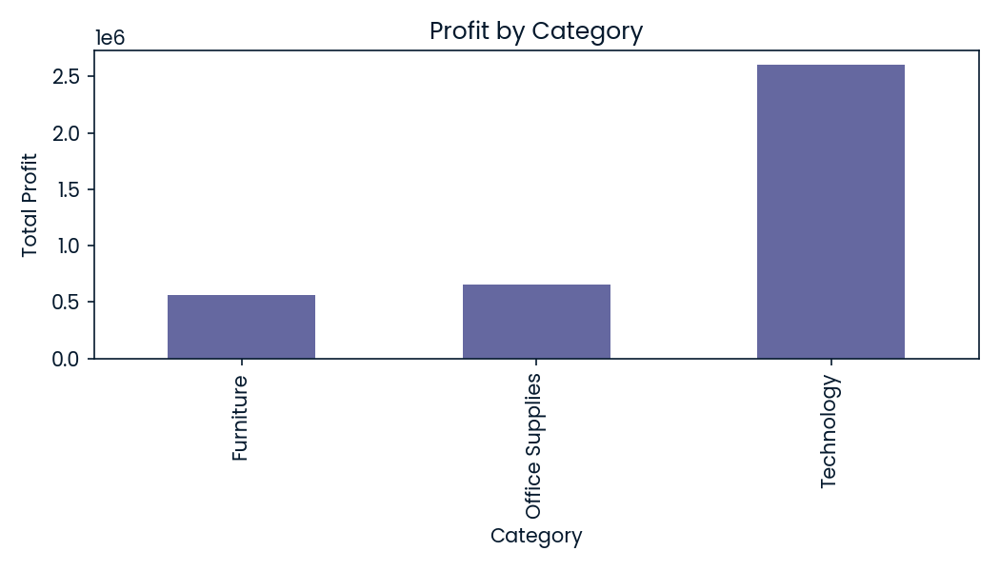
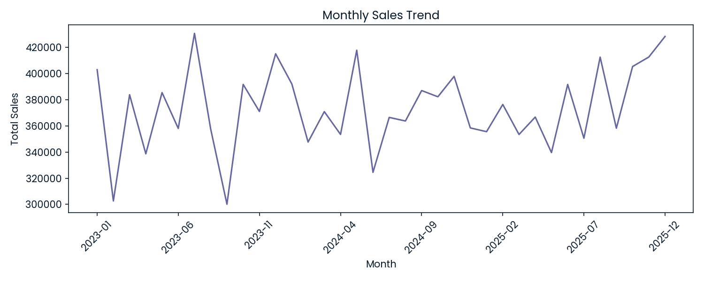

# Sales Performance & Profitability Analysis

## Overview

This project analyzes sales performance and profitability across regions, customer segments, and product categories to identify key revenue drivers and areas of margin leakage.

The goal is to understand how different business factors — including discounting, product mix, and regional performance — impact overall profitability and to provide actionable recommendations for improving financial outcomes.

---

## Business Problem

Which products, regions, and customer segments are driving revenue and profit, and where are the biggest opportunities to improve profitability?

Many businesses generate strong revenue but underperform on profit due to:
- excessive discounting
- low-margin product mix
- regional inefficiencies

This analysis aims to uncover these issues and support data-driven decision-making.

---

## Dataset

The dataset is a realistic business dataset containing:

- Order details (order date, ship date, order ID)
- Customer information (customer ID, segment, region)
- Product hierarchy (category, sub-category, product name)
- Financial metrics (sales, quantity, discount, profit)

The dataset simulates real-world sales and operational data used in business intelligence and financial analytics.

---

## Tools Used

- Python
- pandas
- numpy
- matplotlib
- DataLab (DataCamp)

---

## Analysis Approach

The analysis was conducted in the following steps:

1. Data cleaning and validation
   - removed duplicates
   - handled missing values
   - converted date fields

2. Creation of key performance indicators (KPIs)
   - total sales
   - total profit
   - profit margin
   - average order value

3. Exploratory data analysis (EDA)
   - sales and profit by region
   - performance by category and sub-category
   - time-based trends

4. Profitability analysis
   - discount impact on profit
   - identification of loss-making products
   - comparison of high- vs low-performing segments

---

## Key Insights

### 1. Revenue Concentration Does Not Guarantee Profitability

Some regions generate high sales volume but do not produce the highest profit margins, indicating inefficiencies or heavy discounting.

---

### 2. Technology Products Drive the Majority of Profit

The Technology category contributes the largest share of overall profit, while other categories show weaker margin performance.

---

### 3. Discounting Significantly Impacts Profitability

Higher discount levels are associated with reduced profit margins and, in some cases, negative profitability.

---

### 4. Certain Products Generate Consistent Losses

Some products and sub-categories produce strong sales but consistently generate low or negative profit, indicating potential pricing or cost issues.

---

### 5. Sales Exhibit Seasonal Trends

Sales increase during specific periods (e.g., Q4), suggesting opportunities for targeted promotions and demand planning.

---

## Business Recommendations

### 1. Optimize Discount Strategy
- Reduce excessive discounting on high-demand products
- Implement discount thresholds based on margin impact

---

### 2. Focus on High-Margin Categories
- Increase marketing and sales focus on profitable product lines
- Promote Technology products where margins are strongest

---

### 3. Address Loss-Making Products
- Review pricing strategy for underperforming products
- Consider discontinuing or repositioning low-margin items

---

### 4. Improve Regional Profitability
- Analyze cost structures and discount practices by region
- Align regional strategies with profitability goals

---

### 5. Leverage Seasonal Demand
- Plan promotions around high-demand periods
- Optimize inventory and supply chain for peak seasons

---

## Sample Visualizations

### Sales by Region


---

### Profit by Category



---

### Monthly Sales Trend



---

## Project Structure

```text
sales-performance-analysis
│
├── README.md
├── data
├── notebooks
└── visuals
